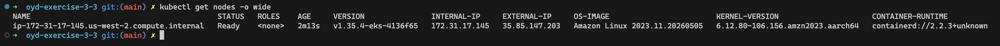

# oyd-exercise-3-3 — Módulo EKS

Contraparte EKS de las demos de clase del curso *Optimizaciones y Desempeño — Cloud Deployment Automation* (sesión 3, 2026-05-07). El repo provisiona un cluster Amazon EKS mínimo con el módulo Terraform de la comunidad, despliega una API Python (`/health`, `/echo`) sobre nodos arm64 y la expone vía un Network Load Balancer.

## Contrato de la aplicación

| Método | Ruta     | Respuesta                                                           |
|--------|----------|---------------------------------------------------------------------|
| GET    | `/health`| `{"status":"ok","compute":"eks"}`                                   |
| POST   | `/echo`  | el JSON del body con `"compute":"eks"` agregado                     |

La app está en [`app/app.py`](app/app.py) — `http.server` raw, sin framework. La imagen publicada es `atreality/ex33-health-api:1.0.0` (arm64, Docker Hub).

## Estructura del repositorio

```
.
├── app/                       # servidor HTTP en Python + Dockerfile
├── infra/
│   ├── provider.tf
│   ├── variables.tf
│   ├── main.tf                # data sources de la VPC default + llamada al módulo
│   ├── outputs.tf
│   ├── envs/dev/dev.tfvars    # valores del entorno dev (us-west-2, t4g.small, 1/2/1)
│   └── modules/eks_cluster/   # wrapper de terraform-aws-modules/eks/aws ~> 20.0
├── k8s/                       # namespace, configmap, deployment, service
└── evidence/                  # screenshot y output de los curl
```

## Ciclo de vida de la infraestructura

Provisión y verificación:

```bash
cd infra/
terraform init
terraform plan  -var-file=envs/dev/dev.tfvars
terraform apply -var-file=envs/dev/dev.tfvars

aws eks update-kubeconfig \
  --region us-west-2 \
  --name $(terraform -chdir=infra output -raw cluster_name)

kubectl get nodes -o wide
```

Build y publicación de la imagen arm64 (compatible con los nodos `t4g.small`):

```bash
docker buildx build --platform linux/arm64 \
  -t atreality/ex33-health-api:1.0.0 \
  --push app/
```

Despliegue y prueba de los endpoints:

```bash
kubectl apply -f k8s/

NLB=$(kubectl get svc health-api -n ex33 \
  -o jsonpath='{.status.loadBalancer.ingress[0].hostname}')

curl http://${NLB}/health
curl -X POST http://${NLB}/echo \
  -H "Content-Type: application/json" \
  -d '{"message":"hello"}'
```

Limpieza (los manifests de Kubernetes se borran primero para que el NLB se quite antes del teardown del VPC):

```bash
kubectl delete -f k8s/
cd infra/
terraform destroy -var-file=envs/dev/dev.tfvars
```

## Parámetros explícitos del módulo

El módulo en `infra/modules/eks_cluster/main.tf` define tres parámetros que el ejercicio marca como críticos:

| Parámetro | Razón |
|---|---|
| `enable_cluster_creator_admin_permissions = true` | Da acceso vía `kubectl` al IAM principal que corrió el `apply`. Sin esto, todas las llamadas devuelven `403`. |
| `cluster_upgrade_policy = { support_type = "STANDARD" }` | Mantiene el cluster en la ventana de soporte estándar y evita que arranque la facturación de soporte extendido de EKS. |
| `ami_type = "AL2023_ARM_64_STANDARD"` (en el node group) | AMI arm64, requerida para los nodos `t4g`. Con la AMI x86_64 por defecto el kubelet falla con `exec format error`. |

## Evidencia

### `kubectl get nodes -o wide`



### Pruebas de los endpoints

Output guardado en [`evidence/curl-output.txt`](evidence/curl-output.txt):

```
=== GET /health ===
HTTP/1.0 200 OK
Server: BaseHTTP/0.6 Python/3.12.13
Content-Type: application/json

{"status": "ok", "compute": "eks"}

=== POST /echo ===
HTTP/1.0 200 OK
Server: BaseHTTP/0.6 Python/3.12.13
Content-Type: application/json

{"message": "hello", "compute": "eks"}
```
